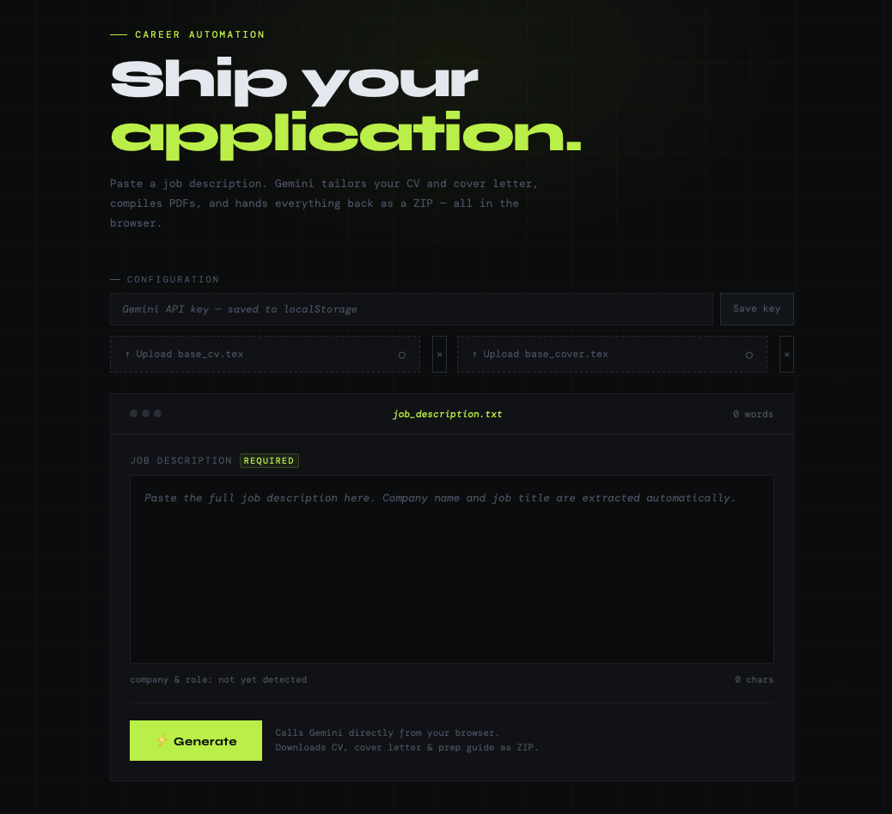

# ⚡ AI Job Application Generator

> Paste a job description. Get a tailored CV, cover letter, and interview prep guide — committed directly to your repo.



---

## How it works

1. You open the web UI (hosted on GitHub Pages)
2. Paste a job description — company name and job title are **extracted automatically**
3. A GitHub Actions workflow fires, running a Gemini agent that:
   - Tailors your CV and cover letter to the JD (honestly — no hallucination)
   - Generates a personal interview prep guide with gap analysis and mock questions
   - Compiles everything to PDF via LaTeX
   - Commits the output folder back to your repo

```
your-repo/
├── company_jobtitle/
│   ├── CV_YourName_Company.tex
│   ├── CV_YourName_Company.pdf
│   ├── Cover_YourName_Company.tex
│   ├── Cover_YourName_Company.pdf
│   └── Interview_Prep_Company.md
```

---

## Stack

| Layer | Tool |
|---|---|
| AI Agent | Google Gemini 3 Flash |
| CV / Cover Letter | LaTeX → PDF via `texlive` |
| CI/CD | GitHub Actions |
| Frontend | GitHub Pages (plain HTML) |

---

## Setup (fork this repo first)

> **Important:** Fork this repo as **private** before adding any secrets or personal files. Do not add your CV or API keys to a public repo.

### 1. Add your base files

Replace the placeholder files in the root of your repo:

| File | What it is |
|---|---|
| `base_cv.tex` | Your master CV in LaTeX format |
| `base_cover_letter.tex` | Your master cover letter in LaTeX format |
| `compile.py` | Your LaTeX → PDF compilation script (see below) |

Your `compile.py` must accept `--input` and `--output` arguments:

```bash
python compile.py --input path/to/file.tex --output path/to/file.pdf
```

### 2. Add GitHub Secrets

Go to your repo → **Settings → Secrets and variables → Actions → New repository secret**:

| Secret | Where to get it |
|---|---|
| `GEMINI_API_KEY` | [Google AI Studio](https://aistudio.google.com/app/apikey) |
| `GH_PAT` | [github.com/settings/tokens](https://github.com/settings/tokens) — needs `repo` + `workflow` scopes |

### 3. Configure the web UI

Open `docs/index.html` and replace these three lines near the bottom of the `<script>` block:

```js
const GITHUB_TOKEN = "your_pat_here";      // your GH_PAT
const REPO_OWNER   = "your_github_username";
const REPO_NAME    = "your_repo_name";
```

### 4. Enable GitHub Pages

Go to your repo → **Settings → Pages**:
- Source: `Deploy from a branch`
- Branch: `main`, folder: `/docs`

### 5. Paste your system prompt into `agent.py`

Open `agent.py` and paste your full career agent instructions into the `SYSTEM_PROMPT` constant at the top. A template prompt is included — customize it with your name, background, and preferences.

### 6. Commit and push

```bash
git add .
git commit -m "feat: init application generator"
git push
```

That's it. Your GitHub Pages URL will be available at:
```
https://your_github_username.github.io/your_repo_name
```

---

## Usage

1. Open your GitHub Pages URL
2. Paste the full job description
3. Click **Generate Application**
4. Wait ~3–5 minutes
5. Your output folder appears in the repo — download the PDFs from there

---

## Customizing the agent

The agent behavior is controlled entirely by `SYSTEM_PROMPT` in `agent.py`. Key things you may want to personalize:

- Your name (used in filenames and documents)
- Your degree / background summary
- Tone and style preferences for the cover letter
- How aggressively to reframe experience vs. flag gaps

The default prompt is designed to be **honest** — it won't fabricate experience, and it explicitly flags stretch claims in the prep guide so you know what to prepare for in interviews.

---

## Repo structure

```
├── .github/
│   └── workflows/
│       └── apply.yml        # GitHub Actions workflow
├── docs/
│   ├── index.html           # GitHub Pages frontend
│   └── screenshot.png       # Add your own screenshot here
├── agent.py                 # Gemini agent
├── compile.py               # LaTeX → PDF (you provide this)
├── base_cv.tex              # Your master CV (you provide this)
├── base_cover_letter.tex    # Your master cover letter (you provide this)
├── requirements.txt
└── README.md
```

---

## Notes

- The Gemini agent uses `gemini-3-flash` for the main generation task and `gemini-3-flash` for the cheap metadata extraction (company name / job title). Swap model strings in `agent.py` as newer models release.
- The GitHub PAT is stored in the frontend JS. This is acceptable for a **private personal tool** — do not use this pattern for a public-facing app.
- LaTeX compilation requires `texlive`. The workflow uses the `texlive/texlive:latest` Docker image which has everything pre-installed.

---

## License

MIT — use it, fork it, build on it.
